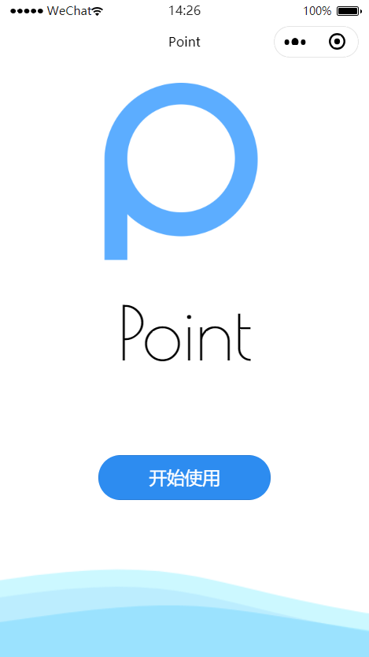
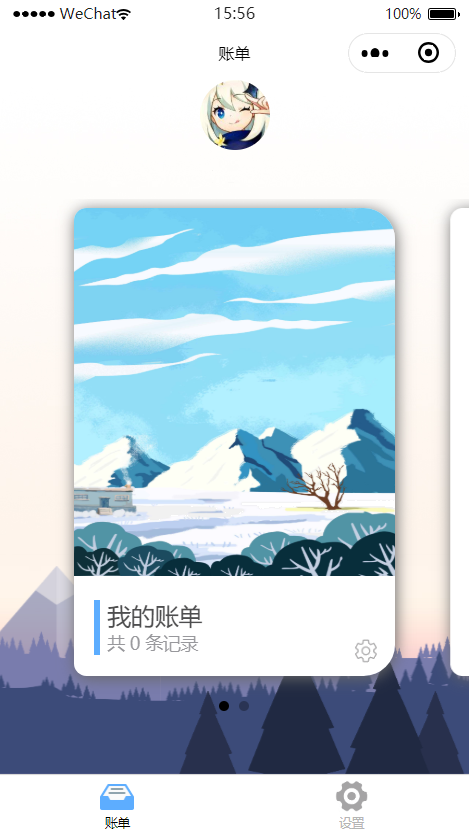
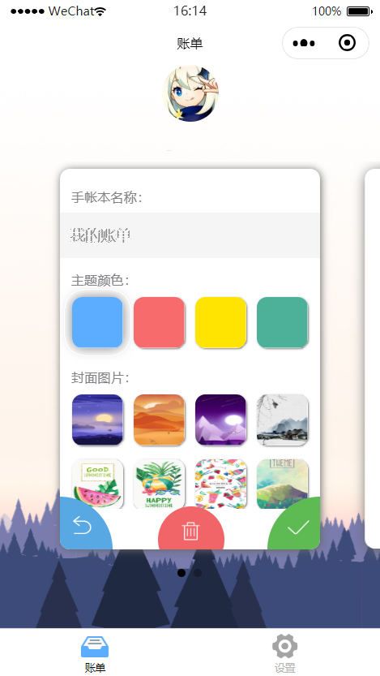
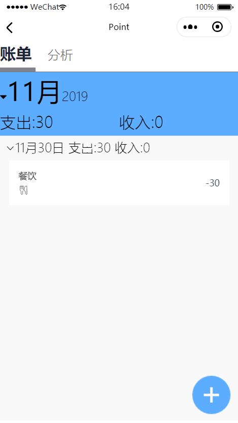
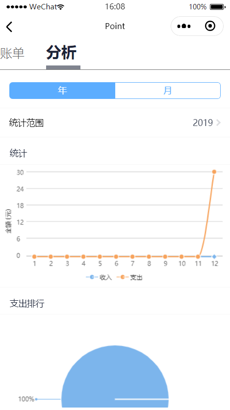
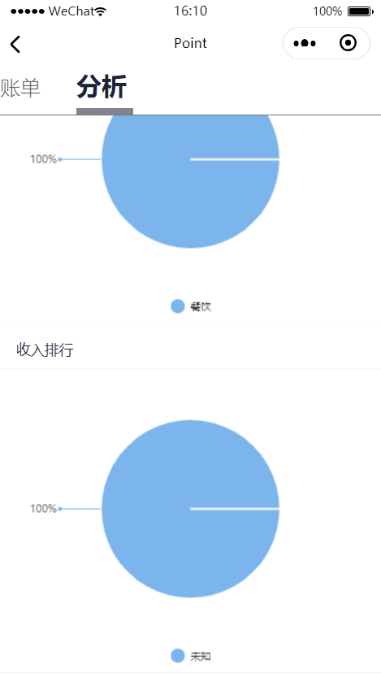

# PointLite

基于微信小程序的记账工具

## 描述

该微信小程序基于“小程序·云开发”平台，使用了微信官方提供的数据库，文件存储以及云函数功能
- [2019-中国高校计算机大赛微信小程序应用开发赛参赛作品](https://developers.weixin.qq.com/community/competition)
- 提供简单的记账操作，数据统计与分析
- 使用了 iView Weapp 的部分控件与布局模板，[点击此处](https://weapp.iviewui.com/)查看 iView Weapp 的相关介绍
- 部分界面设计参考 [Weapp-Demo-LemonJournal](https://github.com/goolhanrry/Weapp-Demo-LemonJournal) 
- 已进行脱敏处理，请在运行前确认你的微信开发者信息并将相应的信息填入代码中

## 目录

- [项目名称](#PointLite)
- [项目描述](#描述)
- [目录](#目录)
- [文件结构](#文件结构)
- [界面演示](#部分界面演示)
- [安装](#安装)
- [参考文档](#参考文档)

## 文件结构

    .
    |-- .gitignore
    |-- package-lock.json
    |-- project.config.json
    |-- README.md
    |-- cloudfunctions
    |   |-- getData
    |   |   |-- index.js
    |   |   |-- package.json
    |   |-- getYearData
    |   |   |-- index.js
    |   |   |-- package.json
    |   |-- handleDatabase
    |   |   |-- index.js
    |   |   |-- package.json
    |   |-- login
    |       |-- index.js
    |       |-- package.json
    |-- miniprogram
        |-- app.js
        |-- app.json
        |-- app.wxss
        |-- sitemap.json
        |-- components
        |   |-- alert
        |   |   |-- index.js
        |   |   |-- index.json
        |   |   |-- index.wxml
        |   |   |-- index.wxss
        |   |-- badge
        |   |   |-- index.js
        |   |   |-- index.json
        |   |   |-- index.wxml
        |   |   |-- index.wxss
        |   |-- button
        |   |   |-- index.js
        |   |   |-- index.json
        |   |   |-- index.wxml
        |   |   |-- index.wxss
        |   |-- cell
        |   |   |-- index.js
        |   |   |-- index.json
        |   |   |-- index.wxml
        |   |   |-- index.wxss
        |   |-- cell-group
        |   |   |-- index.js
        |   |   |-- index.json
        |   |   |-- index.wxml
        |   |-- col
        |   |   |-- index.js
        |   |   |-- index.json
        |   |   |-- index.wxml
        |   |   |-- index.wxss
        |   |-- collapse
        |   |   |-- index.js
        |   |   |-- index.json
        |   |   |-- index.wxml
        |   |   |-- index.wxss
        |   |-- collapse-item
        |   |   |-- index.js
        |   |   |-- index.json
        |   |   |-- index.wxml
        |   |   |-- index.wxss
        |   |-- grid
        |   |   |-- index.js
        |   |   |-- index.json
        |   |   |-- index.wxml
        |   |   |-- index.wxss
        |   |-- grid-item
        |   |   |-- index.js
        |   |   |-- index.json
        |   |   |-- index.wxml
        |   |   |-- index.wxss
        |   |-- helpers
        |   |   |-- arrayTreeFilter.js
        |   |   |-- baseBehavior.js
        |   |   |-- baseComponent.js
        |   |   |-- checkIPhoneX.js
        |   |   |-- classNames.js
        |   |   |-- colors.js
        |   |   |-- computedBehavior.js
        |   |   |-- debounce.js
        |   |   |-- funcBehavior.js
        |   |   |-- gestures.js
        |   |   |-- isEmpty.js
        |   |   |-- mergeOptionsToData.js
        |   |   |-- relationsBehavior.js
        |   |   |-- safeSetDataBehavior.js
        |   |   |-- shallowEqual.js
        |   |   |-- styleToCssString.js
        |   |-- icon
        |   |   |-- index.js
        |   |   |-- index.json
        |   |   |-- index.wxml
        |   |   |-- index.wxss
        |   |-- input
        |   |   |-- index.js
        |   |   |-- index.json
        |   |   |-- index.wxml
        |   |   |-- index.wxss
        |   |-- journalBook
        |   |   |-- journalBook.js
        |   |   |-- journalBook.json
        |   |   |-- journalBook.wxml
        |   |   |-- journalBook.wxss
        |   |-- navbar
        |   |   |-- index.js
        |   |   |-- index.json
        |   |   |-- index.wxml
        |   |   |-- index.wxss
        |   |-- panel
        |   |   |-- index.js
        |   |   |-- index.json
        |   |   |-- index.wxml
        |   |   |-- index.wxss
        |   |-- progress
        |   |   |-- index.js
        |   |   |-- index.json
        |   |   |-- index.wxml
        |   |   |-- index.wxss
        |   |-- row
        |   |   |-- index.js
        |   |   |-- index.json
        |   |   |-- index.wxml
        |   |   |-- index.wxss
        |   |-- segmented-control
        |   |   |-- index.js
        |   |   |-- index.json
        |   |   |-- index.wxml
        |   |   |-- index.wxss
        |   |-- spin
        |   |   |-- index.js
        |   |   |-- index.json
        |   |   |-- index.wxml
        |   |   |-- index.wxss
        |   |-- tab
        |   |   |-- index.js
        |   |   |-- index.json
        |   |   |-- index.wxml
        |   |   |-- index.wxss
        |   |-- tabs
        |   |   |-- index.js
        |   |   |-- index.json
        |   |   |-- index.wxml
        |   |   |-- index.wxss
        |   |-- wxs
        |       |-- array.wxs
        |       |-- bem.wxs
        |       |-- memoize.wxs
        |       |-- object.wxs
        |       |-- utils.wxs
        |-- images
        |   |-- 1.png
        |   |-- 10.png
        |   |-- 11.png
        |   |-- 12.png
        |   |-- 5.png
        |   |-- icons
        |       |-- about1.png
        |       |-- add-icon.png
        |       |-- app_icon.png
        |       |-- feedback1.png
        |       |-- headphone1.png
        |       |-- lock1.png
        |       |-- note-1.png
        |       |-- note-2.png
        |       |-- remove.png
        |       |-- return.png
        |       |-- settings.png
        |       |-- setting_1.png
        |       |-- setting_2.png
        |       |-- submit.png
        |-- lib
        |   |-- font.wxss
        |   |-- fontAwesome.wxss
        |   |-- iconfont.wxss
        |-- pages
        |   |-- about
        |   |   |-- about.js
        |   |   |-- about.json
        |   |   |-- about.wxml
        |   |   |-- about.wxss
        |   |-- detail
        |   |   |-- detail.js
        |   |   |-- detail.json
        |   |   |-- detail.wxml
        |   |   |-- detail.wxss
        |   |-- introduce
        |   |   |-- introduce.js
        |   |   |-- introduce.json
        |   |   |-- introduce.wxml
        |   |   |-- introduce.wxss
        |   |-- logIn
        |   |   |-- logIn.js
        |   |   |-- logIn.json
        |   |   |-- logIn.wxml
        |   |   |-- logIn.wxss
        |   |-- manage
        |   |   |-- manage.js
        |   |   |-- manage.json
        |   |   |-- manage.wxml
        |   |   |-- manage.wxss
        |   |-- note
        |   |   |-- note.js
        |   |   |-- note.json
        |   |   |-- note.wxml
        |   |   |-- note.wxss
        |   |-- setting
        |   |   |-- setting.js
        |   |   |-- setting.json
        |   |   |-- setting.wxml
        |   |   |-- setting.wxss
        |   |-- share
        |       |-- share.js
        |       |-- share.json
        |       |-- share.wxml
        |       |-- share.wxss
        |-- utils
            |-- util.js
            |-- wxcharts.js

## 部分界面演示

  
  
  

  
  
  

## 安装
- 获取代码
  - 执行` git clone https://github.com/agur145/PointLite.git `
  - 或者[点击此处](https://github.com/agur145/PointLite/releases)获取最新释放的版本
- 将压缩包解压后通过微信开发工具把项目导入
- 如果想要进行功能测试，请确认你的微信开发者信息并申请使用云开发平台，其中：
  - 云函数为：`getData()` `getYearData()` `handleDatabase()` `login()` 可直接在本地上传并部署(云端安装依赖)
  - 数据库包含的集合：`notes` `users`
  - 文件存储结构：`/color` 用于储存颜色图片，`/cover` 用于储存账本封面图片
- 完成上述步骤后将账本封面图片文件夹对应的地址填入`/miniprogram/app.js`中的 bookCoverUrl ，将颜色图片文件夹对应的地址填入`/miniprogram/app.js`中的 mainColorUrl 后保存

## 参考文档

- [微信小程序开发文档](https://developers.weixin.qq.com/miniprogram/dev/framework/)

